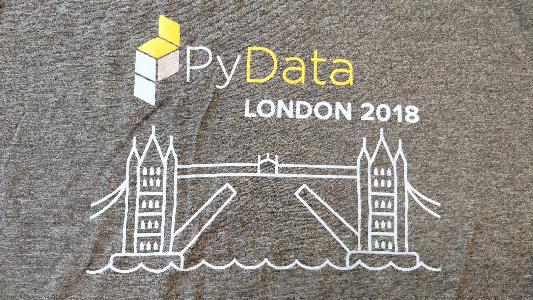
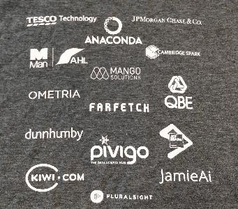

Title: Notes from PyData London 2018
Date: 2018-04-27 18:00
Category: Conferences

# PyData London 2018

Around 700 attendees across three days. Talks covering new techniques and applications of machine learning (ML), natural language processing (NLP), image classification, more traditional methods, graph theory and architecture of data science projects. This was my second PyData conference having previously attended the 2016 event.

If you look at one thing from the talk, pick one of these talks (details below):

- 'Winning with Simple, even Linear, Models' - for ways to get a lot out of linear models
- 'Planes, Trains, and Skateboard Shoes - Bayesian methods in engineering and product design' - just a great talk and intro to Gaussian processes.
- 'Building out data science at QBE' - to see how the competition are doing it.
- 'Python Doesn’t Have to Be Slow: Speeding Up a Large-Scale Optimization Algorithm' - how to get the most out of Python for computationally heavy processes.

From the talks and my chats with other attendees my takeaways are:

- Beyond particular techniques there is still a compelling argument for actuarial teams to adopt many data science practices (use of code, how to measuring model accuracy, version control, notebooks).
- Data science is still a young profession with attendees average age around 30 and many people coming from PhDs in the sciences. There is an energy and enthusiasm among the attendees that is quite infectious.
- Wide range of industries and academia (tech, fashion, taxi apps, supermarkets, insurance (only QBE), banking, telecoms, Google) represented - everyone is investing in this.
- Pace of innovation and development of open source data science is accelerating with new features added to existing tools and new tools being released all the time.
- As a result, fragmented ecosystem tools is a challenge as there are so many options and pros and cons of each option are not clear. Still the pros of open source out-way the cons in my opinion.
- Most people work within mixed teams of developers, IT, data science folk and end customers (e.g. marketers, traders, etc) rather than just with other data scientists which is very different to most actuarial teams in the insurance industry.
- Most people use Slack in their work teams for messaging (replacing email and instant messaging), macs and Linux for computing and Git for version control. Most people code and present their results through Jupyter notebooks. They are comfortable with cloud tools such as Amazon AWS and Google Cloud and avoid proprietary software as much as possible.
- Code is king - no-one is talking about GUIs for data science (although being PyData it is a biased sample). They may use code to build interfaces for exploring data or communicating with their clients.

All talks should end up [here](http://youtube.com/PyDataTV).

## Friday

### Computer Vision: An (Un?)Expected Journey, with Keras and Tensorflow

Speaker: Rodolfo Bonnin (Machinalis)

[GitHub repository](https://github.com/rnditdev/PyData_London_2018_Computer_Vision)

Can also be run on [Google CoLab](https://colab.research.google.com/github/rnditdev/PyData_London_2018_Computer_Vision/blob/master/1_History_of_neural_models.ipynb)

[Keras](https://keras.io/) is a high-level neural networks API, written in Python and capable of running on top of TensorFlow, CNTK, or Theano. It was developed with a focus on enabling fast experimentation. Being able to go from idea to result with the least possible delay is key to doing good research.

Keras seems to be a ML library with a straightforward syntax that incorporates many standard modelling techniques into the default fitting routines (e.g. validation).

Most of the neural net stuff was over my head but this talk introduced many concepts which will make it easier to get started if I start looking at image classification in more detail.

Use of Google CoLab was interesting.

### Apache Airflow in the Cloud: Programmatically orchestrating workloads with Python

Speakers: Satyasheel, Kaxil Naik (Airflow contributor) both at [Data Reply](https://www.datareply.co.uk/)

[GitHub repo](https://github.com/DataReplyUK/airflow-workshop-pydata-london-2018)

Failed to run on my machine due to a combination of Windows and Python 2 issues (Airflow was not working on Python 3 at the time, bug fixed by Sunday apparently). Airflow looks like the go to tool for managing tasks in complex calculations.

Looks like the goto tool for running workflows - potentially useful for ML and capital modelling.

### Network Science, Game of Thrones and US Airports

Speaker: Mridul Seth

[GitHub repo](https://github.com/MridulS/pydata-networkx)

Subject was very interesting and the examples helped with understanding the concepts.

### Hypothesis Testing with SciPy

Speaker: Hillary Green-Lerman, head of data science at Codecademy.com

[Codecademy Course](https://www.codecademy.com/courses/learn-scipy-hypothesis-testing/lessons/hypothesis-testing/exercises/types-of-hypothesis-test)

A bit basic for actuaries I suspect.

### Winning with Simple, even Linear, Models

Speaker: Vincent Warmerdam, koaning.io

http://koaning.io/theme/notebooks/bayes.pdf

Talk differed from the title. Covered a lot of topics but key takeaway was that linear models and feature engineering still have a lot of value compared to more complex ML techniques.

## Saturday

### Keynote: Democratising data journalism: building a collaborative and investigative network across the UK

Speaker: Charles Boutaud

### Data, Science: Investigating 1 Million Galaxies with Humans and TensorFlow

projects/penguintom79/penguin-watch

An astrophysics post grad on labelling galaxy images. He is using a website called [zooniverse](https://www.zooniverse.org/) to get volunteers to crowd source labelling of galaxies.

### Python Doesn’t Have to Be Slow: Speeding Up a Large-Scale Optimization Algorithm

Speaker: Dat Nguyen (Zopa)

[Slides](https://www.dropbox.com/s/c1divrg1ku58a3j/Speeding%20up%20a%20large-scale%20algorithm%20--PyData18.pdf?dl=0)

- Speeding up their NP hard problem using a combination of Numpy over Pandas, joblib and Numba.
- Recommends profiling before optimisation and using ipython profiling.
- Preferred Numba over cython or C++ to keep code Pythonic.
- NamedTuples
- Joblib for parrallisation
- Numba
- Processes 1M assets in 20s

### Creating correct and capable classifiers

Speaker: Ian Ozsvald modelinsight.io, founding member of PyData London

[Slides](https://speakerdeck.com/ianozsvald/creating-correct-and-capable-classifiers-at-pydatalondon-2018)

Working with QBE currently.

[Data_science_delivered GitHub repo](https://github.com/ianozsvald/data_science_delivered)

- pandas_profiling - useful for high level view of data frame
- Use of dummy classifier for a baseline model
- Do repeatedkfold on dummy classifier to understand variability in response
- randomforest to provide new baseline
- [YellowBrick]( https://github.com/DistrictDataLabs/yellowbrick/blob/develop/README.md) highly recommended for visualising ML results
- improve confusion matrix with probabilities in cells
- ELI5 'explain it like I'm 5' library for sklearn models.
- Permeation importance method for finding variable importance across model types
- classification report on splits of data by key factors
- tSNE using fit error to spot poor performing regions
- Pandas colouring in Jupiter notebook?

### Building out data science at QBE

Speakers: Natalie, Liam P. Kirwin, both QBE

- 8 data scientists, 4 software engineers, 20 people total
- Report to head of business intelligence
- One of 7 strategic themes of the company
- Team started with fraud
- Viewed QBE actuarial team as 'old school, better safe than sorry, do everything in Excel'
- Fraud check - checking GP register for GP's details
- A hard fight to get software they needed but now have good relationship with IT
- Noticeably less detailed talk than others - possibly due to not wanting to give away IP (but would equally apply to other presenters)
- [Lime](https://github.com/marcotcr/lime/blob/master/README.md)

### Stationary data? Forget about it! Bayesian forgetting and Random Effects for forecasting TV ratings

Speaker:  Ruadhán Stokes, Channel 4

Bayesian TV forecasting model. Could recursive least squares be applied to claims inflation?
https://github.com/rstokes92/pydata

### Making the Big Data ecosystem work together with Python: Apache Arrow, Spark, Beam, and Dask

Speaker: Holden Karau, Google

## Sunday

### Learning programming and science with Scientific Python

Speaker: Emmanuelle Gouillart ( director of joint CNRS / Saint-Gobain)

- [Slides](https://speakerdeck.com/emmanuelle/pydata-london-how-i-learnt-programming-and-science-with-scientific-python)
- [Scipy Lecture Notes](http://www.scipy-lectures.org)
- Sphinx gallery

### JupyterHub from the Ground Up with Kubernetes

Speaker: Camila Montonen, @spimescape, race-conditions.net

[Slides](https://docs.google.com/presentation/d/1vP5GZKN3lpcqvMnzCdRe-iK_NHb3soAd_gr6YbRQ3Fk/edit?usp=drivesdk)

JupyterHub is a way for creating a consistent porgramming environment with computing resources on remote servers.
Useful for companies, teaching or some.web services (quantopian)

### Databases for Data-Science

Speaker: Alex Hendorf, Konigsweg

[Slides](http://bit.ly/pydata-london-2018-databases-for-data-science)

### Do tyres dream of electric clouds?

Speaker: T. Alisi, Pirelli

[Slides](http://bit.ly/tyredreams-pydata18)

- Data-Science team of around 20
- Used https://www.dominodatalab.com as a data analysis platform.
- See slide 18 for mix of teams and tools.

### Using Survival Analysis to understand customer retention

Speaker: Lorna Brightmore,  tails.com

Use of survival models to predict retention of customers to a dog food subscription service.
Python packages lifelines, sklearn-survival, or in R, KMSurv, OISurv

### Planes, Trains, and Skateboard Shoes - Bayesian methods in engineering and product design

Speaker: Jim Parr, Maclaren Applied Technologies

[GitHub rep](https://github.com/jimparr19/pydata2018)

Used notebook slides which looked really cool. Use of Gaussian processes to optimise design of products. One of the best talks I saw.

## Talks I missed

### Test-Driven Data Analysis

https://github.com/tdda/pydatalondon2018ad

http://www.tdda.info/?from=@

Missed this one but looks interesting

### Deep Probabilistic Methods with PyTorch

https://github.com/chrisorm/pydata-2018

### Visualising NLP pipelines with Pynorama

Didn't see talk but new tool looks really useful. [GitHub Repo](https://github.com/manahl/pynorama).

### Optimisation

https://github.com/gcampanella/pydata-london-2018

### Evaluating fairness in machine learning with PyMC3

Couple of the papers mentioned in the fairness talk:
- Counterfactual Fairness https://arxiv.org/abs/1703.06856
- Fairness in Criminal Justice Risk Assessments: The State of the Art https://arxiv.org/abs/1703.09207

For the Fairness talk, Google has published an interactive visualisation for understanding various fairness policies: https://research.google.com/bigpicture/attacking-discrimination-in-ml/

Based on paper ‘Equality of Opportunity in Supervised Learning’: https://arxiv.org/abs/1610.02413

### RNN sequence labeling for document parsing in Tensorflow

Speaker: Carsten van Weelden, textKernel, Nederland

Using recurring neural network (RNN) to parse over CVs to create structured data.
Used TensorBoard to visualise the NN.

### Searching for Shady Patterns: Shining a light on UK corporate ownership

https://github.com/Cadarn/pyDataLDN2018_network_corporations

### CatBoost

New ML technique that is yielding strong results.

### Touchdown Localisation with aircraft flight data

### More About Generators

Benefits of linear models

### Making computation easier with cool Numpy tricks

https://github.com/kirit93/NumpyTutorial

Missed this one but heard lots of good things so need to watch the video.

### Understanding and diagnosing your machine-learning models

Speaker: Gael Varoquaux, one of the founding contributors to sci-kit learnt

Missed this one but attendees said the talk was very good.

http://gael-varoquaux.info/interpreting_ml_tuto/

https://github.com/GaelVaroquaux/interpreting_ml_tuto

### Demystifying pandas internals
